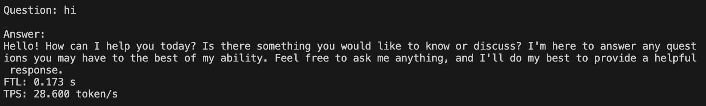

# Qwen1.5

## 目录
  - [1. 简介](#1-简介)
  - [2. 特性](#2-特性)
  - [3. 运行环境准备](#3-运行环境准备)
  - [4. 模型编译](#4-模型编译)
  - [5. 模型推理](#5-模型推理)

## 1. 简介
Qwen1.5 是Qwen的第二代版本，它是开源中英双语对话模型，关于它的特性，请前往源repo查看：https://huggingface.co/Qwen。本例程对Qwen进行移植，使之能在SOPHON BM1684X上进行推理测试。

该例程支持在V23.07.01(libsophon_0.4.9)及以上的SDK上运行，支持在插有1684X加速卡(SC7系列)的x86主机上运行，也可以在1684X SoC设备（如SE7、SM7、Airbox等）上运行。在SoC上运行需要额外进行环境配置，请参照[运行环境准备](#3-运行环境准备)完成环境部署。

## 2. 特性
* 支持BM1684X(x86 PCIe、SoC)
* 支持FP16、INT8、INT4模型编译和推理
* 支持基于SAIL推理的Python例程
* 支持多轮对话

## 3. 运行环境准备
在PCIe上无需修改内存，以下为soc模式相关：
对于1684X系列设备（如SE7/SM7），都可以通过这种方式完成环境准备，使得满足Qwen运行条件。首先，在1684x SoC环境上，参考如下命令修改设备内存。
```bash
cd /data/
mkdir memedit && cd memedit
wget -nd https://sophon-file.sophon.cn/sophon-prod-s3/drive/23/09/11/13/DeviceMemoryModificationKit.tgz
tar xvf DeviceMemoryModificationKit.tgz
cd DeviceMemoryModificationKit
tar xvf memory_edit_{vx.x}.tar.xz #vx.x是版本号
cd memory_edit
./memory_edit.sh -p #这个命令会打印当前的内存布局信息
./memory_edit.sh -c -npu 7615 -vpu 3072 -vpp 3072 #npu也可以访问vpu和vpp的内存
sudo cp /data/memedit/DeviceMemoryModificationKit/memory_edit/boot.itb /boot/boot.itb && sync
sudo reboot
```
> **注意：**
> 1. tpu总内存为npu/vpu/vpp三者之和，fp16模型应满足tpu内存 >= 12800 MB，int8应满足tpu内存 >= 7168MB，int4应满足tpu内存 >= 4608MB。
> 2. 更多教程请参考[SoC内存修改工具](https://doc.sophgo.com/sdk-docs/v23.07.01/docs_latest_release/docs/SophonSDK_doc/zh/html/appendix/2_mem_edit_tools.html)

### 3.1 mlir版本
  从sftp上获取TPU-MLIR压缩包
  ```bash
  pip3 install dfss --upgrade
  python3 -m dfss --url=open@sophgo.com:sophon-demo/Qwen/tpu-mlir_v1.6.113-g7dc59c81-20240105.tar.gz 
  tar -xf tpu-mlir_v1.6.113-g7dc59c81-20240105.tar.gz 
  ```

### 3.2 sail版本
airbox/SE7 默认使用Python3.8版本，请使用arm pcie版本
X86请在下文提供的docker内安装（docker内置python版本 3.10），请使用x86 pcie版本

```bash
  pip3 install dfss --upgrade #安装dfss依赖

  #x86 pcie, py310
  python3 -m dfss --url=open@sophgo.com:/LLM/LLM-TPU/sophon-3.7.0-py3-none-any.whl
  pip3 install sophon-3.7.0-py3-none-any.whl
  
  #arm pcie, py38
  python3 -m dfss --url=open@sophgo.com:sophon-demo/ChatGLM3/sail/arm_pcie/sophon_arm_pcie-3.7.0-py3-none-any.whl
  pip3 install sophon_arm_pcie-3.7.0-py3-none-any.whl
```

### 3.3 docker 版本
  TPU-MLIR使用的docker是sophgo/tpuc_dev:latest, docker镜像和tpu-mlir有绑定关系，少数情况下有可能更新了tpu-mlir，需要新的镜像。
  ```bash
  docker pull sophgo/tpuc_dev:latest
  # 这里将本级目录映射到docker内的/workspace目录,用户需要根据实际情况将demo的目录映射到docker里面
  # myname只是举个名字的例子, 请指定成自己想要的容器的名字
  docker run --name myname -v $PWD:/workspace -it sophgo/tpuc_dev:latest
  # 此时已经进入docker，并在/workspace目录下
  # 初始化软件环境
  cd /workspace/tpu-mlir_vx.y.z-<hash>-<date>
  source ./envsetup.sh
  ```
此镜像仅onnx模型导出和编译量化模型，程序编译和运行请在开发和运行环境中进行。更多TPU-MLIR的教程请参考[算能官网](https://developer.sophgo.com/site/index/material/31/all.html)的《TPU-MLIR快速入门手册》和《TPU-MLIR开发参考手册》。

## 4. 模型编译
## 4.1 获取onnx
### 4.1.1 下载Qwen官方代码

从Huggingface下载模型
```bash
git lfs install
git clone https://huggingface.co/Qwen/Qwen1.5-1.8B-Chat
```
如果git clone完代码之后出现卡住，可以尝试`ctrl+c`中断，然后进入仓库运行`git lfs pull`。

### 4.1.2 修改官方代码：
本例程的`tools`目录下提供了修改好之后的`config.json`和`modeling_qwen2.py`。(transformers请更新到4.38.2以上)可以直接替换掉原仓库的文件：

```bash
cp compile/Qwen1.5-1.8B-Chat/config.json Qwen1.5-1.8B-Chat/
cp compile/Qwen1.5-1.8B-Chat/modeling_qwen2.py /usr/local/lib/python3.10/dist-packages/transformers/models/qwen2/
```

### 4.1.3 导出onnx
- 导出所有onnx模型，如果过程中提示缺少某些组件，直接**pip install**组件即可

```bash
# 将/workspace/Qwen-7B-Chat换成docker环境中您的Qwen-7B-Chat仓库的路径
python3 compile/export_onnx.py --model_path /workspace/Qwen1.5-1.8B-Chat --sequence_length your_sequence_length
```
此时有大量onnx模型被导出到本例程中`compile/tmp/onnx`的目录。

### 4.2 bmodel编译
首先需要在mlir工具下激活环境，如果之前没有下载mlir工具，[mlir下载地址可参考](./Qwen_Export_Guide.md/#212-下载并解压tpu-mlir)
```bash
cd tpu-mlir_v1.6.113-g7dc59c81-20240105
source envsetup.sh
```
目前TPU-MLIR支持1684x对Qwen1.5进行BF16(仅限Qwen-1.8B),INT8和INT4量化，使用如下命令生成bmodel。

```bash
./compile.sh --mode int4 --name qwen1.5-1.8b
```

其中，mode可以指定bf16/int8/int4，编译成功之后，模型将会存放在`compile`目录下。

### 4.3 准备tokenizer
tokenizer已经放在了`python`文件夹下

## 5. 模型推理
```bash
cd python
python3 qwen.py --bmodel your_bmodel_path --token ./token_config --dev_id your_dev_id
```
跑通后效果如下图所示



## 6. Web_Demo的使用
在此之前您需要将所有需要的模型移动到bmodels文件夹下【目前支持Qwen1.5和ChatGLM3】
其中模型命名格式为```modelname_type.bmodel```, 对应的tokenizer文件夹应该为```modelname_tokenizer```，如
模型为```chatglm3-6b_int4.bmodel```，对应的tokenizer为```chatglm3-6b_tokenizer```
事例如下：
```
.bmodels
├── chatglm3-6b_tokenizer               # chatglm3-6b 所使用的tokenizer
│   ├── ...                       
│   └── ...                   
├── qwen1.5-1.8b_tokenizer              # qwen1.5-1.8b 所使用的tokenizer
│   ├── ...                       
│   └── ... 
├── qwen1.5-1.8b_int4_1dev.bmodel       # qwen1.5-1.8b int4 的模型                 
└── chatglm3-6b_int4_1dev.bmodel        # chatglm3-6b int4 的模型   
```

```bash
cd web
python3 web_demo.py
```
进入后首先根据下拉框选择模型，系统会根据```bmodels```下的bmodel自动获取当前可用模型以及对应的tokenizer。选择好后点击```Load Bmodel```，之后即可在对话框中进行对话。